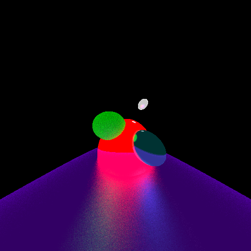

# python-raytracer

This is primitive ray-tracer built in python3 without the use of any helper libraries.

The theory is simple, and the code is only 165 SLoC. The scope of this project is very limited, but it does what is supposed to. Further resources can be found at [Ray Tracing in One Weekend](https://raytracing.github.io/books/RayTracingInOneWeekend.html) and [Ray Tracing from Scratch in 10 Minutes | Javascript](https://www.youtube.com/watch?v=aASyRKDpqhc)

*Example render in 500x500 pixels*

## Configuration
Configuration is done through the `main.py` python file. The following is a table of configurable variables at the top of the file:

| attribute    | description                                                                       |
|--------------|-----------------------------------------------------------------------------------|
| WIDTH        | set pixel width of the final image                                                |
| HEIGHT       | set pixel height of the final image                                               |
| FOCAL_LENGHT | set FOV, the higher the more zoomed in                                            |
| SAMPLE_RATE  | samples per pixel, higher values decrease noise at the expense of more operations |
| MAX_STEPS    | maximum look depth for reflections                                                |

Furthermore, the objects are stored into a dictionary format. The only type of object supported is a sphere. Description of the structure is as follows:

| key          | value                                                              |
|--------------|--------------------------------------------------------------------|
| shape        | always set to "sphere"                                             |
| pos          | position of the object, 3 item array                               |
| color        | emission color                                                     |
| reflectivity | reflectivity of red, green, and blue light. 3 item array           |
| roughness    | how rough and object is, the higher the less sharp reflections are |

## Running & requirements
Running is simply `python3 main.py` and wait for the result to appear under the name `result.png`. It will automatically override the last output, so saving better ones by renaming them is recommended.

Requirements are:
- Python version >= 3.5
- PIL (Pillow), this is only for convenience. TGA would have been equally easy to use.
